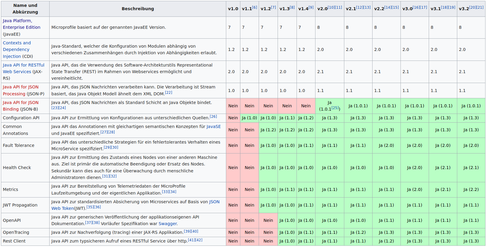

Eclipse MicroProfile
====================
:author:    Gunther Rotsch
:backend:   slidy
:max-width: 45em
:data-uri:
:icons:
:duration: 5
:source-highlighter: pygments

Java Enterprise History
-----------------------
[width="100%",cols="^3,20,15",options="header"]
|=========================================================
| Version / Release | Name | Date

| 1.0 	|Java 2 Platform Enterprise Edition, v 1.0 	|Dezember 1999
| 1.2 	|Java 2 Platform Enterprise Edition, v 1.2 	|2000
| 1.3 	|Java 2 Platform Enterprise Edition, v 1.3 	|September 2001
| 1.4 	|Java 2 Platform Enterprise Edition, v 1.4 	|November 2003
| 5 	|Java Platform, Enterprise Edition, v 5 	|Mai 2006
| 6 	|Java Platform, Enterprise Edition, v 6 	|Dezember 2009
| 7 	|Java Platform, Enterprise Edition, v 7 	|Mai 2013
| 8 	|Java Platform, Enterprise Edition, v 8 	|September 2017
| 8 	|Jakarta EE 8                            	|September 2019
| 9 	|Jakarta EE 9                            	|??? 2020

|=========================================================

Java Enterprise Profiles
------------------------
[float]
=== Java EE for Web Applications
* Full Profile and Web Profile since JEE 6
* Application Servers can implement one or the other or both Profiles

[float]
=== Jakarta EE for Micro Service Architectures
* Micro Profile since 2018
* Eclipse Standard overlaps with JEE

Micro Profile Releases
-----------------------

[width="100%",cols="^3,6",options="header"]
|=========================================================
| Version / Release | Date

| 1.0 | September, 2016 	
| 1.1 | August, 2017 	
| 1.2 | September, 2017 	
| 1.3 | January, 2018 	
| 1.4 | June 2018 	
| 2.0 | June 2018 	
| 2.1 | October, 2018
| 2.2 | February, 2019 	
| 3.0 | June, 2019 	
| 3.1 | October, 2019 	
| 3.2 | November, 2020 	
| 3.3 | February, 2020 	

|=========================================================

Micro Profile Components
------------------------

Micro Profile Config
--------------------

[role="incremental"]
* Solution to externalise Configuration from Microservices
* Config Properties are provided by `ConfigSources`
* `ConfigSources` are ordered according to the ordinal of the ConfigSource
* By default, there are 3 default `ConfigSources`:
 - `System.getProperties()` (ordinal=400)
 - `System.getenv()` (ordinal=300)
 - all `META-INF/microprofile-config.properties` files on the class path. (default ordinal=100)
[role=""]

Micro Profile Config, cont.
---------------------------
[source,java,width=100]
----
public class ServiceBean {

    private String userId;

    @Inject
    public ServiceBean(@ConfigProperty(name="userId") String userId) {
        this.userId = userId;
    }
    
    public void doSomething() {
        // do something  
    }
}
----

Micro Profile Config, cont.
---------------------------
[source,java,width=100]
----
public class ServiceBean {

    private Config config;

    @Inject
    public ServiceBean(Config config) {
        this.config = config;
    }
    
    public void doSomething() {
        String userId = config.getValue("userId", String.class);
        
        // do something  
    }
}
----

Micro Profile Health
--------------------
GET /health
[source,json,width=100]
----
200 OK 
{
    "outcome": "UP", 
    "checks": [
    {
        "name": "datasource",
        "state": "UP", 
        "data": {
            "dbConnection": "...",
            "dbName": "...", 
            "freeSpace": "..."
        },
    },
    {
        "name": "resources",
        "state": "UP"
        "data": {
            "app-data": "some application data"
        }
    }]
}
----

Micro Profile Health, cont.
---------------------------
[source,java,width=100]
----
@Health
public class AppHealthCheck implements HealthCheck {
    @Override
    public HealthCheckResponse call() {
        return HealthCheckResponse
                .named("resources")
                .withData("app-data","some application data" )
                .state(true)
                .build();
    }
}
----

Micro Profile Health, cont.
---------------------------
[source,java,width=100]
----
@Readiness
public class AppReadinessCheck implements HealthCheck {
    @Override
    public HealthCheckResponse call() {
        if (!isReady()) {
            return HealthCheckResponse
                    .named(App.class.getSimpleName() + "Readiness")
                    .withData("services", "not available")
                    .down()
                    .build();
        }
        return HealthCheckResponse
            .named(App.class.getSimpleName() + "Readiness")
            .withData("services", "available")
            .up()
            .build();
    }

    private boolean isReady() {
        // check readiness of service
        // eg. by checking readiness of dependent services
    }
}
----

Micro Profile Metrics, cont.
----------------------------

GET /metrics/base

[source,shell]
----
200 OK 
classloader.totalLoadedClass.count=12595
cpu.systemLoadAverage=3.88525390625
gc.PSScavenge.time=262
thread.count=30
classloader.currentLoadedClass.count=12586
jvm.uptime=4795005
memory.committedHeap=740818944
thread.max.count=46
cpu.availableProcessors=4
gc.PSMarkSweep.count=3
    ...
----
